---

<details>
<summary><b>How this profile is built</b></summary>

<br>

Six self-contained SVG panels, all 860px wide so they stack into one
column. Every animation is **SMIL** — GitHub strips `<script>` and
sanitizes inline CSS from README-embedded SVGs, but it does run SMIL
inside images loaded via ``. No JavaScript, no third-party badge
services, no tracking pixels.

The pixel art (GPU fans, service icons) is authored as character grids
and rendered by [`scripts/sprites.py`](scripts/sprites.py), which
collapses horizontal runs into single rects to keep file size down.
Motion uses the classic flipbook trick — every frame drawn in place,
visibility swapped on a discrete-timed loop — rather than transforms, so
frames snap instead of cross-fading into motion blur.

Both columns of the neofetch card live inside a *single* SVG rather than
a markdown table — GitHub's table rendering can't be relied on to hold
two images in exact alignment, but an SVG's internal coordinates always
will.

### Panels

| File | Source | Auto-updates |
|---|---|---|
| `hero-banner.svg` | `scripts/make_hero_banner.py` | ❌ manual |
| `neofetch-card.svg` | `scripts/make_neofetch_card.py` | ❌ manual |
| `agency-panel.svg` | `scripts/make_agency_panel.py` | ❌ manual |
| `knowledge-panel.svg` | `scripts/make_knowledge_panel.py` | ❌ manual |
| `hardware-panel.svg` | `scripts/make_hardware_panel.py` | ❌ manual |
| `contrib-heatmap.svg` | `scripts/render_heatmap_svg.py` | ✅ daily |

Shared palette, geometry and animation helpers live in
[`scripts/theme.py`](scripts/theme.py) — change a color there and every
panel follows.

### Rebuild

```bash
pip install -r scripts/requirements.txt
python scripts/build_all.py
```

`--static` skips the network fetch and rebuilds only the hand-authored
panels:

```bash
python scripts/build_all.py --static
```

### Editing content

- **Wordmark / tagline** → `WORDMARK`, `TAGLINE` in `make_hero_banner.py`
- **Info rows** → `ROWS` in `make_neofetch_card.py`
- **Agency + services** → `AGENCY_NAME`, `SERVICES` in `make_agency_panel.py`
- **Knowledge categories** → `CATEGORIES` in `make_knowledge_panel.py`
- **Machines** → `MACHINES` in `make_hardware_panel.py`
- **Colors** → `theme.py`

The knowledge panel deliberately carries **no proficiency bars, star
ratings or percentages** — those numbers would be invented, since nothing
measures them. It names domains; the repos are the evidence. Its layout
is greedy-masonry (each card drops into the shortest column) and the
`tree`-style footer count is computed from the data, so adding or
removing topics can't desync the layout or the summary.

### Contribution data

`fetch_contributions.py` reads the public contribution calendar at
`github.com/users/<username>/contributions` — the same HTML fragment that
renders the graph on any public profile. No token, no API quota. The
daily Action re-runs it and commits only the heatmap.

</details>

<br>

<p align="center">
  <a href="https://github.com/Thunderx10">github</a> ·
  <sub>self-contained SVG + SMIL — no JavaScript, no third-party services</sub>
</p>
